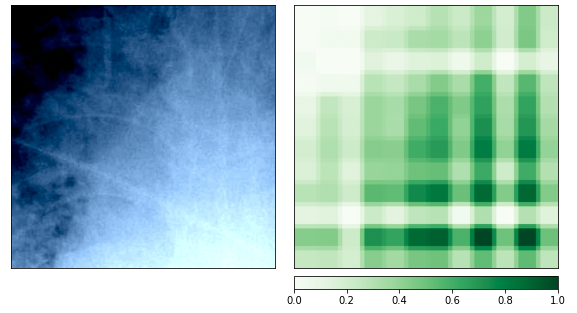
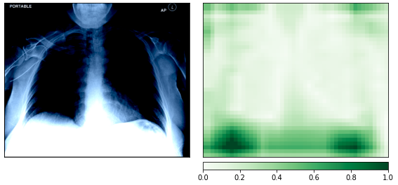

# resnext-ranzcr

**Description of challenge**: Classify the presence and correct placement of tubes on chest x-rays to save lives

**Dataset**: CLiP, catheter and line position dataset[1]

**Model Architecture**: resnext50_32x4d

**Performance**: 93% accuracy using 4-fold cross-validation (comparable to state of the art models in literature[2])

**Explainability**: Using occlusion-based attribution to see regions of high importance to the model's decision-making process, thus adding interpretability

**Purpose**: This notebook goes through the steps for explaining this model. It is accompanied by the resnext-training.ipynb notebook which shows the training and evaluating process.  

**Notes for use**: notebook assumes kaggle environment and .cuda() availability. 

*[1]: https://www.nature.com/articles/s41597-021-01066-8.pdf*

*[2]: https://www.ncbi.nlm.nih.gov/pmc/articles/PMC8017400/pdf/ryai.2020190082.pdf*

**Examples of explainability**:

